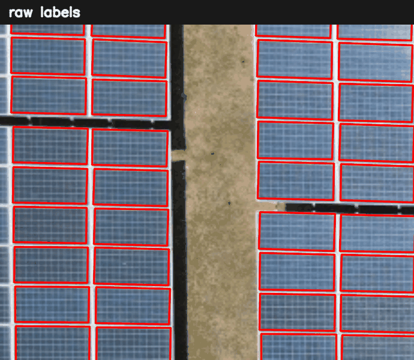
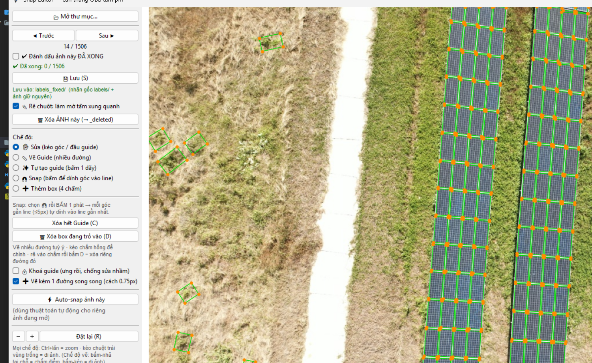

<div align="center">

# 🛰️ Solar Panel OBB Annotator

**Semi-automatic annotation of solar panels as oriented bounding boxes (OBB) in top-down drone imagery.**

Label solar farms in the **YOLOv8-OBB** format, then auto-straighten every panel onto clean grid lines — with a guide-based GUI for fast manual touch-up.

[](LICENSE)
[](https://www.python.org/)
[](#dataset-format-yolov8-obb)
[](#)
[](https://github.com/Chisoku/solar-obb-annotator/stargazers)



*Put guides on the panel edges → the corners snap onto the white borders.*

</div>

---

## Why

Hand/auto labels of solar panels are usually off by a few pixels at the corners, so a perfectly regular grid of panels ends up as a wobbly set of boxes. This tool fixes that:

* **Batch auto-snap** — detects each panel row/strip, estimates its tilt, and snaps corners onto shared column/row lines.
* **Guide-based GUI** — draw (or auto-generate) reference lines, then snap corners onto them; the corners stay attached and follow the guide when you move it.

---

## Features

**Batch (`snap_obb.py`)**
- Auto orientation estimate per strip (no fixed angle across strips).
- Groups panels into vertical strips, snaps each corner to its column/row median.
- Keeps natural gaps between panels; caps movement so nothing collapses.
- Debug mode: before/after overlay images.

**Interactive GUI (`snap_gui.py`)**
- ✨ **Auto-generate guides** for a strip you click — outer border = single line, inter-panel gaps = double lines.
- 📏 **Draw guides** freely (optional linked parallel companion), 🧲 **snap** corners to the nearest guide / intersection.
- Corners **attach** to guides and follow when a guide is moved. Guide endpoints **magnetize** & can be **welded** to move together.
- ✋ Drag corners, ➕ add boxes, 🗑 delete boxes / individual guides.
- **Undo / Redo** (`Ctrl+Z` / `Ctrl+Y`), spotlight hover, mark-as-done per image, delete image to trash.
- Never overwrites your original labels — writes to a separate `labels_fixed/` folder.



---

## Requirements

- Python 3.9+
- `numpy`, `opencv-python`, `Pillow`, `matplotlib`
- **Tkinter** (ships with most Python installs; on Debian/Ubuntu: `sudo apt install python3-tk`)

```bash
pip install -r requirements.txt
```

---

## Dataset format (YOLOv8-OBB)

```
<dataset>/
  train/images/*.jpg   train/labels/*.txt
  valid/images/*.jpg   valid/labels/*.txt
  test/images/*.jpg    test/labels/*.txt
```

Each label line — 4 corners, normalized `0..1` by image width/height:

```
class_id  x1 y1  x2 y2  x3 y3  x4 y4
```

The corner order is auto-detected geometrically (it does not have to be consistent).

---

## Usage

### 1) Interactive GUI (recommended)

```bash
python snap_gui.py --labels <dataset>/train/labels \
                   --images <dataset>/train/images \
                   --out    <dataset>/train/labels_fixed
```

Or just run `python snap_gui.py` and click **“Open folder…”** to pick the `labels` and `images` folders.
Results are saved to `labels_fixed/` (originals untouched). Progress (“done” flags) is stored in `snap_done.json`.

**Typical workflow:** ✨ click a strip to auto-generate guides → nudge a few guides → 🧲 click to snap → ✋ fix stragglers → mark done → next image.

### 2) Batch auto-snap (no UI)

```bash
# one split
python snap_obb.py --labels <dataset>/train/labels --images <dataset>/train/images --out <dataset>/train/labels_snapped

# whole dataset (train/valid/test -> <split>/labels_snapped), with a few debug previews
python snap_obb.py --dataset <dataset> --debug-dir preview --debug-n 5
```

### 3) Matplotlib-only editor (fallback)

```bash
python snap_editor.py --labels <dataset>/train/labels --images <dataset>/train/images --out <dataset>/train/labels_fixed
```

---

## GUI controls

| Action | How |
|---|---|
| Zoom | **Ctrl + mouse wheel** (or `+` / `−` buttons) |
| Pan | **Left-drag on empty area**, right-drag, or two-finger scroll |
| Modes | ✋ Edit · 📏 Draw guide · ✨ Auto-guide · 🧲 Snap · ➕ Add box |
| Snap corners | 🧲 mode → **click** once (corners within 5 px snap to nearest guide/intersection) |
| Move a guide | ✋ mode → drag the pink endpoint (yellow ring = grabbable) |
| Weld / unweld guide endpoints | drag endpoints together to weld · **Ctrl+H** to unweld |
| Undo / Redo | **Ctrl+Z** / **Ctrl+Y** |
| Delete box / guide | **D** / **Del** while hovering it |
| Next / Prev image | **N** / **B** (auto-saves) · or click the file list |
| Save | **S** (also auto-saves on navigation) |

> **Note:** the GUI labels are currently in Vietnamese; they are plain strings in `snap_gui.py` and easy to localize.

---

## Files

| File | Purpose |
|---|---|
| `snap_gui.py` | Interactive guide-based annotation GUI (Tkinter + matplotlib) |
| `snap_obb.py` | Batch auto-snap / alignment (also importable) |
| `snap_editor.py` | Minimal matplotlib editor (fallback) |

---

## License

MIT — see [LICENSE](LICENSE).

Example imagery shown here is derived from the *solar-segment-obb* dataset on
[Roboflow Universe](https://universe.roboflow.com/qu-nguyn-nh-s-workspace/solar-segment-obb) (CC BY 4.0).
The dataset itself is **not** included in this repository.
